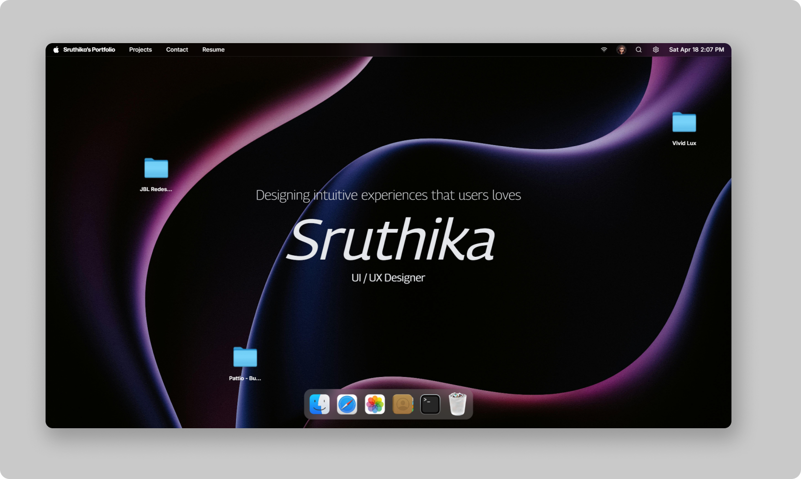

# Sruthika Portfolio 🚀

Welcome to my personal portfolio repository! This project showcases my skills, projects, and experience as a UI/UX Designer. The portfolio is designed as a modern macOS-inspired interactive experience, highlighting my expertise in user-centric design and high-fidelity prototyping.

## Features 🌟

- **macOS Interface**: A unique, interactive desktop environment with windows, dock, and folder navigation.
- **Project Showcase**: Detailed case studies including JBL Redesign, Vivid Lux, and Pattio, featuring designs and live demos.
- **Skills**: A comprehensive list of my technical expertise, including design software, prototyping tools, and user research methodologies.
- **Gallery**: A curated collection of design inspiration and visual experiments.
- **Interactive Boot Flow**: A custom, polished loading sequence inspired by Apple's boot process.
- **Responsive Design**: Optimized for seamless viewing on desktops, tablets, and mobile devices.

## Technologies Used 🛠️

- **Frontend**: React.js, Framer Motion, GSAP, Tailwind CSS, Lucide React
- **Development**: Vite, Node.js, npm
- **Design Tools**: Figma, Sketch, Adobe XD, Protopie
- **Version Control**: Git, GitHub

## Preview Image 📸

## Contact 📬

Feel free to reach out for collaboration, job opportunities, or feedback:
- **Email**: sruthika384@gmail.com
- **GitHub**: [github.com/sruthika299](https://github.com/sruthika299)
- **LinkedIn**: [linkedin.com/in/sruthika-k-144389331](https://www.linkedin.com/in/sruthika-k-144389331/)
- **Instagram**: [instagram.com/sruthxxa__](https://www.instagram.com/sruthxxa__/)

Thank you for visiting my portfolio repository! Contributions and suggestions are welcome via pull requests or issues on this repository.
